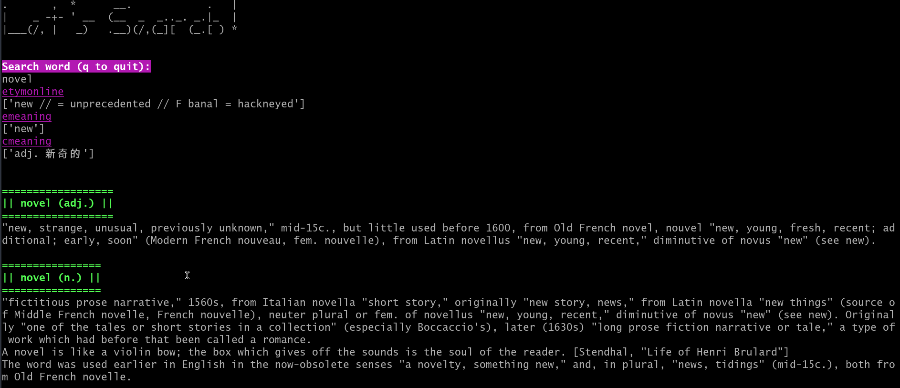

# About this project

When memorizing the GRE vocabulary, I believe we (as a foreigner), should understand the vocabulary by their meanings first.
This project is an unfinished version. I write this to satisfy my personal need, and this repository may not get future updates.
This is a flash card project, you can memorize other stuffs as well


What I want: 

- [x] Search vocabulary on both my CSV notes and https://www.etymonline.com/
- [x] Take personal notes on each vocabulary
  - [x] Each CSV file corresponds to a vocabulary book. Automatically fill in duplicate words when working on a new vocabulary book (inputs/B.csv). 
  - [x] Merge all CSV into one final file, remove duplicate, keep notation up-to-date.
- [x] Run on cell phone (Android) & desktop (Linux / Windows) 
- [x] Switch between different config files
- [x] Save time and review section


# Usage
## Install require packages

```bash
pip install -r requirements.txt
```

### Switch between different config files

- Write you own config file
- Run main.py, input 'cfg' to switch config
- Need to put one of the config files as placeholder in /config/config_parser.py line 15:
  - conf='xxx' <= one of your config file here

### Along side with third-party vocabulary software
Need `abd`
You can modify Android screen coordinates in `tools.py` `adb_func(move)`
- my phone: one plus 7
- third-party vocabulary software in demo: 
  - https://www.kmf.com/static/appcenter?website=gre
  - https://play.google.com/store/apps/details?id=com.enhance.google.greapp (older version)

### Config
Config example:
```
[data_utils]
col = list: ["word", "etymonline", "emeaning", "cmeaning"]  # your csv structure
# file used to check duplicate
default_name = str: All.csv  # if input a word occur in this csv, it will auto copy to your woking csv

[function]
out_name = str: Reading-GRE.csv  # the book you currently working on
use_adb = bool: False
# for back up func
back_i = int: 0
```

### Review (Computer)
- Input `rev` will return last 10 words, you can change block in `main.py`
- Input `r-number` : `r-1`(for example) will return last 60 words (can be changed in function.py, def rev_custom(self, rev_position, block = 60))
- Input `f-number` : `f-1`(for example) will return last 30 words in flash card (can be changed in function.py, def rev_custom(self, rev_position, block = 30))
- Input `rf-number` or `rr-number` : `rf-1`(for example) will return shuffled results
- You can search and modify in target csv as well, default editor is VIM
- All your review time and review section will be saved in `/oth/log.txt` (closed by defalut)

### Review (Android Phone)
- Install git in `Termux`
- Run `phone_rev.py` (or other code) in `Pydroid3`, remember pre install packages


## Screenshot
Review (ConEmu on Windows)


Search




Run on android (Pydroid 3)


Alongside with software (check /demo/03.mp4)


